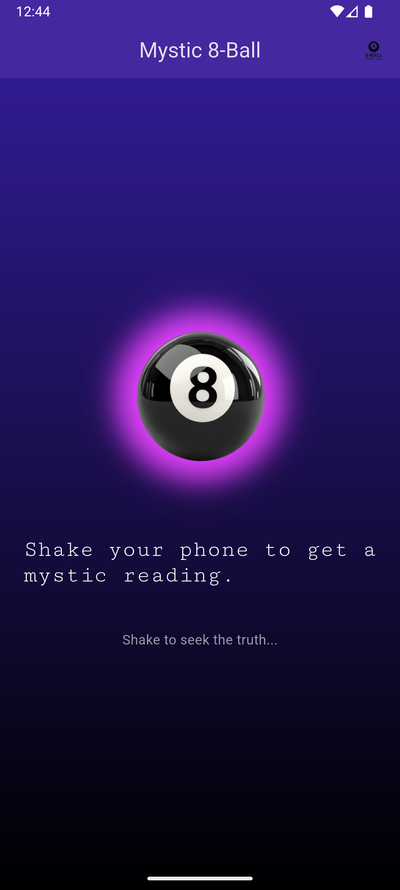

# 🎱 8-Ball Fortune Teller App

Welcome to the **8-Ball Fortune Teller App**! Shake your phone, and get random mystical fortunes — just like the Magic 8-Ball. With smooth animations, fun predictions, and an interactive UI, it's designed to give you an engaging experience.

### ✨ Features:

* **Shake your phone** to get a random fortune
* **Magic 8-Ball style responses** for fun predictions
* **Smooth animated text reveals** using `AnimatedTextKit`
* **Gyroscope-based shake detection** via `sensors_plus`
* **Custom app icon & splash screen** with a magical glow
* **Engaging UI with playful themes**

---

## 📸 Screenshots

### Splash Screen & Home Page

*Splash Screen 1*

*Splash Screen 2*

*Main interface showing fortunes*

---

## 🔗 APK Download

You can download the APK file and install it directly on your Android device.

**[Download APK](https://drive.google.com/file/d/1Y6vZu2YTlGcTKdvj4yekTWp5iw7Xv063/view?usp=drivesdk)**

---

## 🔧 Technologies Used:

* **Flutter** for the frontend
* **sensors\_plus** for gyroscope shake detection
* **animated\_text\_kit** for smooth text animations
* **audioplayers** for sound effects
* **flutter\_launcher\_icons** for custom app icons

---

## 🛠️ Contributions

Feel free to fork this project, create an issue, or submit a pull request for improvements!

---
